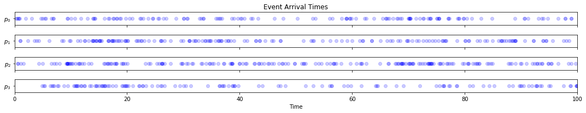
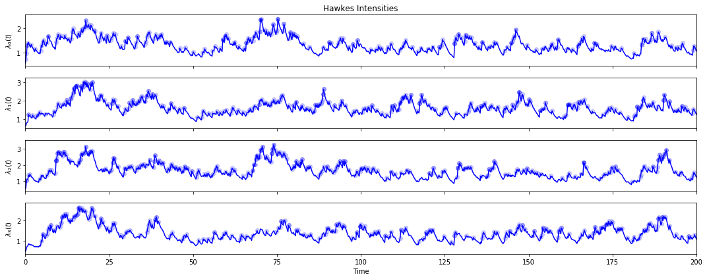
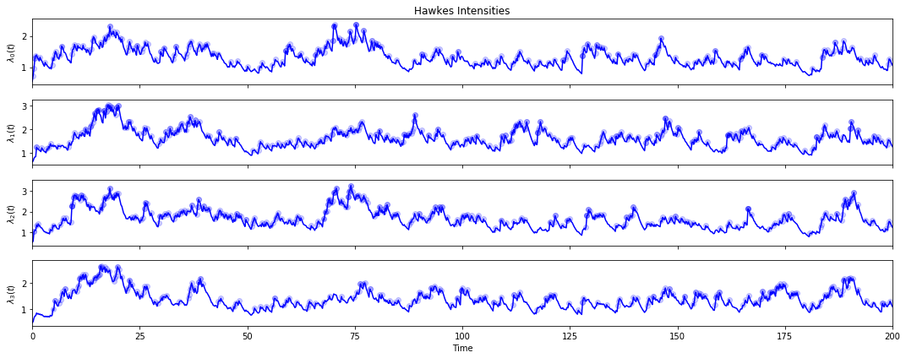
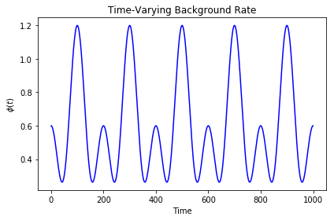
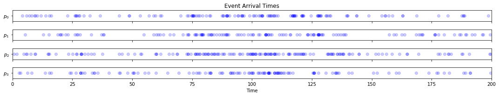
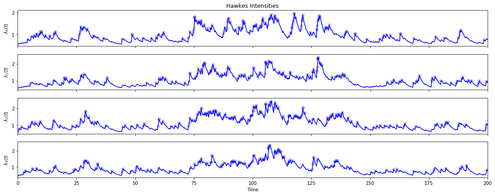
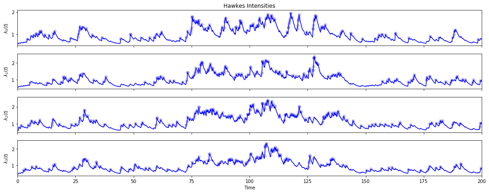

Excitatory point processes describe random event sequences in which new arrivals increase rates of future occurrence. The excitation framework has significant applications to fields that feature elements of temporal clustering across different dimensions; examples include modeling of earthquake aftershocks, crime rates, and financial contagion.

The multivariate Hawkes Process put forward in Hawkes (1971) is a popular model for excitatory point processes. Its conditional intensity function (CIF) leverages a Poissonian background process to generate immigrant events with independent arrival times; immigrants then excite arrivals of offspring events, which themselves generate more offspring.

Alternatively, the generating process can be reframed as a mixture of independent Poisson processes, namely the immigrant-generating background rate and past arrivals’ time-decaying excitatory influence. The Hawkes process therefore lends itself to a branching structure, whereby each arrival is spawned by a single generating process in the Poissonian mixture.

This package provides easy and fast simulation and parameter estimation for multivariate Hawkes processes with exponential memory kernels. Both stationary and time-varying background rates are considered.


```python
# !python setup.py build_ext --inplace <- to convert cython file to c (first time only)
```


```python
from hawkes_estimator import *
from numpy.random import uniform
from numpy import fill_diagonal,sqrt,ndarray
import matplotlib.pyplot as plt
```

# Multivariate Hawkes Process

### Generate Example Hawkes Parameters


```python
DIMS = 4 # num dimensions
BACKGROUND_RATE_BOUNDS = [0.4,0.6] # mu bounds
SELF_EXCITATION_RATE_BOUNDS = [0.3,0.4] # alpha matrix diagonal bounds
MUTUAL_EXCITATION_RATE_BOUNDS = [0.05,0.1] # alpha matrix non-diagonal bounds
DECAY_BOUNDS = [0.5,0.6] # beta bounds
```


```python
# generate random parameters given above bounds
def generate_params(U,mu_bnd,alpha_diag_bnd,alpha_nondiag_bnd,beta_bnd):
    mu = uniform(mu_bnd[0],mu_bnd[1],U)
    alpha = uniform(alpha_nondiag_bnd[0],alpha_nondiag_bnd[1],(U,U))
    fill_diagonal(alpha,uniform(alpha_diag_bnd[0],alpha_diag_bnd[1],U))
    beta = uniform(beta_bnd[0],beta_bnd[1])
    return mu,alpha,beta
```


```python
mu,alpha,beta = generate_params(DIMS,BACKGROUND_RATE_BOUNDS,SELF_EXCITATION_RATE_BOUNDS,MUTUAL_EXCITATION_RATE_BOUNDS,DECAY_BOUNDS)
```

### Simulate Hawkes Process


```python
hwk = HawkesEM()
```


```python
hwk.simulate_data(params=(mu,alpha,beta),N=100000)
# hwk.load_data(t,u) <- if importing data from elsewhere
```


```python
hwk.plot_events(horizon=100)
```





### Estimate Hawkes Parameters (Known Decay)


```python
mu_hat,alpha_hat = hwk.fit(beta,eps=0.001,inc=20,verbose=True)
```

    Preparation ->   0.04s ----------------
    Epoch    20 ->   0.10s ----------------
    Epoch    40 ->   0.16s - diff: 2.29e+01
    Epoch    60 ->   0.22s - diff: 6.33e+00
    Epoch    80 ->   0.27s - diff: 2.41e+00
    Epoch   100 ->   0.29s - diff: 9.69e-01
    Epoch   120 ->   0.32s - diff: 3.77e-01
    Epoch   140 ->   0.35s - diff: 1.45e-01
    Epoch   160 ->   0.38s - diff: 5.65e-02
    Epoch   180 ->   0.41s - diff: 2.21e-02
    Epoch   200 ->   0.44s - diff: 8.67e-03
    Epoch   220 ->   0.46s - diff: 3.37e-03
    Epoch   240 ->   0.49s - diff: 1.28e-03
    Epoch   260 ->   0.52s - diff: 4.59e-04
    


```python
def RMSE(pred,actual):
    return sqrt(((pred-actual)**2).mean())
```


```python
mu_RMSE = RMSE(mu,mu_hat)
alpha_RMSE = RMSE(alpha,alpha_hat)
```


```python
print("Background Rates RMSE = {}".format(round(mu_RMSE,2)))
print("Excitation Rates RMSE = {}".format(round(alpha_RMSE,2)))
```

    Background Rates RMSE = 0.02
    Excitation Rates RMSE = 0.01
    


```python
params = mu_hat,alpha_hat,beta
hwk.plot_intensities(params,horizon=200)
```





### Estimate Hawkes Parameters (Unknown Decay)


```python
mu_hat,alpha_hat,beta_hat = hwk.fit(eps=0.001,inc=20,verbose=True)
```

    beta =  0.0000 ->   0.00s - loglike: -1.000000e+06
    beta =  1.0000 ->   0.43s - loglike: -6.935619e+04
    beta =  2.0000 ->   0.68s - loglike: -6.997183e+04
    beta =  1.5000 ->   0.94s - loglike: -6.969020e+04
    beta =  0.7500 ->   1.27s - loglike: -6.919723e+04
    beta =  0.5000 ->   1.65s - loglike: -6.912125e+04
    beta =  0.2500 ->   2.15s - loglike: -6.940960e+04
    beta =  0.3750 ->   2.61s - loglike: -6.918076e+04
    beta =  0.5625 ->   3.01s - loglike: -6.912412e+04
    beta =  0.4688 ->   3.93s - loglike: -6.912647e+04
    beta =  0.5156 ->   4.79s - loglike: -6.912045e+04
    beta =  0.5312 ->   5.56s - loglike: -6.912072e+04
    beta =  0.5234 ->   6.32s - loglike: -6.912046e+04
    beta =  0.5117 ->   7.19s - loglike: -6.912055e+04
    beta =  0.5176 ->   8.08s - loglike: -6.912043e+04
    beta =  0.5195 ->   9.32s - loglike: -6.912044e+04
    beta =  0.5166 ->  10.13s - loglike: -6.912044e+04
    


```python
mu_RMSE = RMSE(mu,mu_hat)
alpha_RMSE = RMSE(alpha,alpha_hat)
beta_RMSE = RMSE(beta,beta_hat)
```


```python
print("Background Rates RMSE = {}".format(round(mu_RMSE,2)))
print("Excitation Rates RMSE = {}".format(round(alpha_RMSE,2)))
print("Decay Rate RMSE = {}".format(round(alpha_RMSE,2)))
```

    Background Rates RMSE = 0.02
    Excitation Rates RMSE = 0.01
    Decay Rate RMSE = 0.01
    


```python
params = mu_hat,alpha_hat,beta_hat
hwk.plot_intensities(params,horizon=200)
```





# Multivariate Hakwes Process with Time-Varying Background Rate

### Generate Example Time-Varying Hawkes Parameters


```python
# using mu, alpha, beta from above example**
# example time-varying background rate function
freqs = np.array([100,200])/(2*np.pi)
amp = np.array([0.3,0.3])
offset = 100
def f(x):
    def fi(x):
        return np.sum(amp*np.cos((x-offset)/freqs)) + np.sum(amp)
    if type(x) != ndarray:
        return fi(x)
    else:
        return np.array([fi(xi) for xi in x])
```


```python
# background rate average and maximum
x = np.arange(0,1000,0.1)
favg = np.mean(f(x))
fmax = np.max(f(x))*1.1
bkgd_params = (f,fmax,favg)
```


```python
# plot time-varying background rate
fig,ax = plt.subplots()
ax.plot(x, f(x), color='blue')
ax.set_title('Time-Varying Background Rate')
ax.set_xlabel('Time')
ax.set_ylabel('$\phi(t)$')
fig.tight_layout()
```





### Simulate Hawkes Process


```python
hwk = TimeVarHawkesEM()
```


```python
hwk.simulate_data(params=(mu,alpha,beta,bkgd_params),N=100000)
# hwk.load_data(t,u,bkgd) <- if importing data from elsewhere
```

    100%|████████████████████████████████████████████████████████████████████████████████| 100000/100000 [00:18<00:00, 5393.26it/s]
    


```python
hwk.plot_events(horizon=200)
```





### Estimate Hawkes Parameters (Known Decay)


```python
mu_hat,alpha_hat = hwk.fit(beta,eps=0.001,inc=20,verbose=True)
```

    Preparation ->   0.07s ----------------
    Epoch    20 ->   0.14s ----------------
    Epoch    40 ->   0.20s - diff: 2.23e+01
    Epoch    60 ->   0.27s - diff: 2.20e+00
    Epoch    80 ->   0.33s - diff: 5.12e-01
    Epoch   100 ->   0.40s - diff: 1.61e-01
    Epoch   120 ->   0.47s - diff: 5.44e-02
    Epoch   140 ->   0.53s - diff: 1.78e-02
    Epoch   160 ->   0.59s - diff: 5.61e-03
    Epoch   180 ->   0.65s - diff: 1.73e-03
    Epoch   200 ->   0.71s - diff: 5.29e-04
    


```python
mu_RMSE = RMSE(mu,mu_hat)
alpha_RMSE = RMSE(alpha,alpha_hat)
```


```python
print("Background Rates RMSE = {}".format(round(mu_RMSE,2)))
print("Excitation Rates RMSE = {}".format(round(alpha_RMSE,2)))
```

    Background Rates RMSE = 0.03
    Excitation Rates RMSE = 0.01
    


```python
params = mu_hat,alpha_hat,beta
hwk.plot_intensities(params,horizon=200)
```





### Estimate Hawkes Parameters (Unknown Decay)


```python
mu_hat,alpha_hat,beta_hat = hwk.fit(eps=0.001,inc=20,verbose=True)
```

    beta =  0.0000 ->   0.00s - loglike: -1.000000e+06
    beta =  1.0000 ->   0.43s - loglike: -1.073922e+05
    beta =  2.0000 ->   0.78s - loglike: -1.084186e+05
    beta =  1.5000 ->   1.19s - loglike: -1.079500e+05
    beta =  0.7500 ->   1.78s - loglike: -1.071266e+05
    beta =  0.5000 ->   2.38s - loglike: -1.070027e+05
    beta =  0.2500 ->   3.60s - loglike: -1.075381e+05
    beta =  0.6250 ->   4.40s - loglike: -1.070318e+05
    beta =  0.4375 ->   4.98s - loglike: -1.070327e+05
    beta =  0.5312 ->   5.67s - loglike: -1.070008e+05
    beta =  0.5625 ->   6.25s - loglike: -1.070058e+05
    beta =  0.5469 ->   6.75s - loglike: -1.070026e+05
    beta =  0.5234 ->   7.17s - loglike: -1.070006e+05
    beta =  0.5156 ->   7.59s - loglike: -1.070008e+05
    beta =  0.5195 ->   8.18s - loglike: -1.070007e+05
    beta =  0.5254 ->   8.60s - loglike: -1.070006e+05
    beta =  0.5224 ->   9.07s - loglike: -1.070006e+05
    


```python
mu_RMSE = RMSE(mu,mu_hat)
alpha_RMSE = RMSE(alpha,alpha_hat)
beta_RMSE = RMSE(beta,beta_hat)
```


```python
print("Background Rates RMSE = {}".format(round(mu_RMSE,2)))
print("Excitation Rates RMSE = {}".format(round(alpha_RMSE,2)))
print("Decay Rate RMSE = {}".format(round(alpha_RMSE,2)))
```

    Background Rates RMSE = 0.03
    Excitation Rates RMSE = 0.01
    Decay Rate RMSE = 0.01
    


```python
params = mu_hat,alpha_hat,beta_hat
hwk.plot_intensities(params,horizon=200)
```




